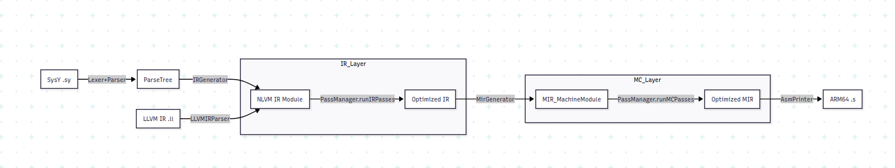
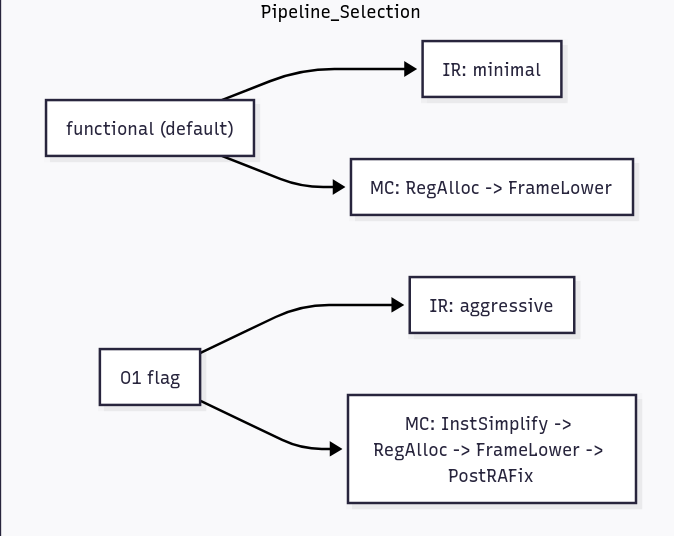
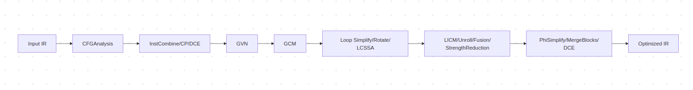
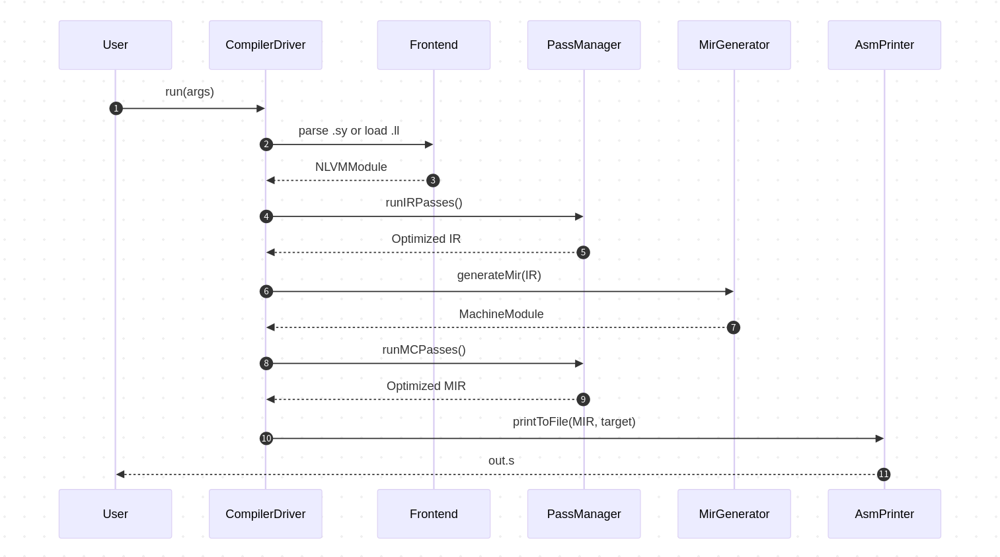

## NLVM 编译器技术文档

本文档基于对代码库的实际阅读，围绕 pass/PassManager.java、frontend/irgen/IRGenerator.java、backend/MirGenerator.java 等核心文件，系统说明 NLVM 的目标、架构、流程、设计模式与 API。适用于快速理解与扩展本项目。

---

## 1. 项目概述

- 1.1 项目目的与功能

  - NLVM 是面向 SysY 语言的编译器，支持：
    - 从 SysY 源（.sy）经 ANTLR 前端生成中间表示（NLVM IR）
    - 或从 LLVM IR 文本（.ll）直接加载为 NLVM IR
    - 经过 IR 优化 Pass 流水线与 MIR 生成，再经后端 Pass 输出 ARM64 汇编（.s）
  - 支持功能校验流水线（最小 Pass）与 -O1 优化流水线，支持 -emit-llvm 输出 IR 快照

- 1.2 技术栈与依赖

  - JDK 17，Gradle（application、java）
  - ANTLR 4.12（lib/antlr-4.12.0-complete.jar）
  - 生成代码目标平台：Armv8-A（AArch64）

- 1.3 项目结构（核心目录与文件）
  - compiler2025-nlvm/src
    - frontend
      - grammar（ANTLR 生成）
      - irgen/IRGenerator.java（IR 生成）
    - ir（类型系统、Value/Instruction、NLVMModule、IR 打印）
    - pass（Pass 接口/工厂、IRPass/MCPass、PassManager）
    - backend（MirGenerator、AsmPrinter、MIR 结构）
    - driver（CompilerDriver、Config）
    - util（日志、IList、LLVM IR 解析）
  - compiler2025-nlvm/build.gradle（构建脚本，含 generateAntlr）
  - src 入口：Compiler.java → driver.CompilerDriver

---

## 2. 系统架构

- 2.1 整体架构图

- 2.2 数据流向与处理流程

  1. SysY 词法/语法 → ParseTree → IRGenerator 产出 NLVMModule；或 .ll 用 LLVMIRParser 装载为 NLVMModule
  2. PassManager 运行 IR 流水线，对 IR 进行分析/优化
  3. MirGenerator 将 IR 翻译为 MIR（含映射关系、CFG 构建、PHI 处理）
  4. PassManager 运行后端流水线，完成寄存器分配、帧降低、Spill 地址传播等

- 2.4 PassManager 管线示意

- 2.5 IR 优化阶段视图（简化）

5. AsmPrinter 输出 .data/.bss/.text 段汇编

- 2.3 模块接口与通信方式
  - driver.CompilerDriver：解析参数，决定源类型与输出目标，串联前端/Pass/MIR/后端/打印
  - pass.PassManager：枚举工厂化配置 pass 序列，顺序运行；支持系统属性按名过滤启用
  - backend.MirGenerator：IR→MIR 翻译，登记映射表；在生成后由后端 Pass 精化
  - backend.AsmPrinter：将 MachineModule 渲染为 ARM64 汇编文本

---

## 3. 设计模式

- 3.1 单例（Singleton）

  - PassManager、MirGenerator、AsmPrinter、NLVMModule、driver.Config
  - 目的：全局唯一上下文与编排；提供 reset 能力便于测试（如 PassManager.resetInstance、NLVMModule.reset）

- 3.2 枚举工厂（Enum + Supplier Factory）

  - IRPassType、MCPassType 实现 PassType<T>，以 Supplier<T> 注入构造
  - 好处：注册集中、构造延迟、流水线清晰；权衡：构造参数灵活性较低（可按需扩展配置）

- 3.3 访问者（Visitor）

  - IRGenerator 继承 SysYParserBaseVisitor，在语法树节点上分派 IR 构造逻辑

- 3.4 建造者（Builder）

  - ir.Builder 提供“定位 + 构建”能力（positionAtEnd + build\*）

- 3.5 流水线（Pipeline）

  - PassManager 维护两条流水线（IR/MC），按优化级别（functional/O1）选择编排

- 3.6 设计权衡
  - 正确性优先的最小流水线与性能优先的 O1 流水线同时保留，便于在不同评测场景取舍
  - 在 Pass 执行后可选 IR 快照/轻量校验，有助于快速定位破坏性变换

---

## 4. 核心流程

- 4.1 命令行与运行

  - 支持参数：
    - -o <file>：输出文件（.s 或 .ll）
    - -S：生成汇编
    - -O1：启用 O1 优化流水线
    - -emit-llvm：输出 IR（与 -S 可并用）
  - JVM 系统属性：
    - -Dir.passes=mem2reg,gvn,gcm（小写，逗号分隔）
    - -Dmc.passes=regallocpass,frameloweringpass
    - -Ddebug=true（打印每个 pass 名等调试信息）
  - 示例：
    - gradle run --args="-S -o out.s test.sy"
    - gradle run --args="-S -O1 -emit-llvm -o out.s test.sy" -Dir.passes=mem2reg,gvn -Ddebug=true

- 4.2 Pass 流水线

  - 功能流水线（默认）：
    - IR：默认不跑或仅少量分析（避免超时）
    - MC：RegAllocPass → FrameLoweringPass
  - O1 流水线（-O1）：
    - IR：多轮 MergeBlocks / FunctionInline / TailRecursionElimination / CFGAnalysis / InstCombine / GVN / GCM /
      LCSSA / LoopSimplify / LoopRotate / LICM / Unroll / Fusion / StrengthReduction / DeadLoopElimination /
      IfToSelect / ConstantPropagation / DeadCodeElimination / GlobalValueLocalize / ParameterizeGlobalScalars /
      PhiSimplify / BlockLayout / GEP\* 系列 等（详见 PassManager.setO1Pipeline）
    - MC：InstSimplify → RegAllocPass → FrameLoweringPass → PostRASpillAddrProp
  - 精细启用：通过 -Dir.passes/-Dmc.passes 限定枚举名运行子集

- 4.3 关键算法与逻辑（摘选）
  - IR 层：SSA 提升（Mem2reg）、全局冗余消除（GVN）、全局代码移动（GCM）、循环变换（Simplify/Rotate/LICM/Unroll/Fusion/StrengthReduction/DeadLoop）、
    分支归约（IfToSelect）、块布局（BlockLayout）、GEP 合并与简化（GEPJoint/GEPSimplify/GEPFuse/LoopGEPCombine）、数组/全局处理等
  - MIR 生成：
    - AAPCS 参数传递（GPR/FPR/溢出到栈的 LDARG 伪指令）、基本块/指令翻译、PHI 处理
    - 常量乘法/除法/取模优化（移位+加法分解、2^k-1 模式、libdivide 风格参数计算与序列）
  - 错误与健壮性：
    - CompileException 用于参数错误；LLVMIRParser 抛 LLVMParseException
    - PassManager.hasBadStoreNLVM() 辅助探测 IR 中“可疑 store”模式（调试用）

---

## 5. API 文档（核心）

- 5.1 driver.CompilerDriver

  - parseArgs(String[] args)：解析 -o/-S/-O1/-emit-llvm 与源文件（.sy/.ll）
  - run()：根据源类型编译/加载 IR，运行 IR Pass；-emit-llvm 输出 IR；-S 时生成 MIR → 运行 MC Pass → 打印 .s
  - compileSysYToIR(Path) → NLVMModule：ANTLR → ParseTree → IRGenerator.visit
  - loadIR(Path) → NLVMModule：读取 .ll 文本 → LLVMIRParser.parse

- 5.2 pass.PassManager

  - getInstance()/resetInstance()
  - runIRPasses()/runMCPasses()：顺序执行流水线；debug 模式打印 pass 名称
  - getPass(Class<T>)：跨 pass 获取上下文工具
  - 系统属性：ir.passes/mc.passes 控制启用子集（枚举名小写）

- 5.3 pass.Pass 与工厂（pass/Pass.java, PassType.java, IRPassType.java, MCPassType.java）

  - 接口：

    - IRPass：IRPassType getType(); void run();
    - MCPass：MCPassType getType(); void run();

- 工厂：PassType<T>.constructor()/create()/getName()；IRPassType/MCPassType 通过 Supplier 注册具体 Pass

- 5.4 frontend.irgen.IRGenerator

  - 构造：IRGenerator(String moduleName)
  - 语法树访问：visitSyProgram/visitSyFuncDef/visitSyVarDecl/... 产出 NLVM IR
  - 要点：符号表/作用域、类型提升与转换、数组初始化扁平化/嵌套重建、大数组零填充优化、条件/循环/函数返回处理

- 5.5 ir.NLVMModule

  - 单例：getModule()/reset()
  - 函数：addFunction()/registerFunction()/getFunction()/removeFunction()
  - 全局：addGlobal()/addGlobalWithInit()/getGlobalVariable()/getGlobalVariables()
  - 库函数：getOrDeclareLibFunc(name)（含 starttime/stoptime 到 _sysy_\* 的别名映射）
  - 打印：toNLVM()/printToFile(String)

- 5.6 backend.MirGenerator

  - getInstance()/reset()
  - generateMir(NLVMModule) → MachineModule：处理全局（字符串/数组/零初始化）、函数（块/参数/指令翻译/控制流/PHI）

- 6.4 端到端数据流

- 指令翻译注册：Opcode → translator（算术/浮点/逻辑/比较/内存/控制流/类型转换/PHI）
- 常量乘除模优化：pow2/两位 1/2^k-1 序列，libdivide 分支自由参数计算与发射

- 5.7 backend.AsmPrinter

  - printToString(MachineModule)：输出 .data（显式初值）→ .bss（零填充）→ .text（函数）
  - printToFile(MachineModule, String)

- 5.8 driver.Config

  - 字段：isO1、isDebug（从 -Ddebug 读取）
  - getFlag(String)：读取布尔系统属性

- 5.9 util.llvm（LLVMIRParser/LoaderConfig）
  - parse(List<String>, String) → NLVMModule
  - LoaderConfig：错误处理模式（STRICT 等）

---

## 6. 构建与运行

- 6.1 构建

  - generateAntlr：从 util/\*.g4 生成到 src/frontend/grammar，并插入 package frontend.grammar
  - compileJava 依赖 generateAntlr
  - application.mainClass=Compiler；jar 清单同名

- 6.2 运行示例

  - 功能流水线汇编：gradle run --args="-S -o out.s sample.sy"
  - O1 + IR 输出：gradle run --args="-S -O1 -emit-llvm -o out.s sample.sy"
  - 仅启用部分 IR Pass：gradle run --args="-S -o out.s sample.sy" -Dir.passes=mem2reg,gvn -Ddebug=true

- 6.3 日志
  - 可通过 -Ddebug=true 增加 Pass 层日志
  - build.gradle 指定 -Dlog4j.configurationFile=src/main/resources/log4j2.xml（如需自定义输出请补充该文件）

---

## 7. 扩展指南

- 7.1 新增 IR Pass

  1. 在 pass/IRPass 下实现类，实现 Pass.IRPass
  2. 在 IRPassType 注册 Supplier
  3. 在 PassManager 对应流水线中编排（functional 或 O1）
  4. 用 -Dir.passes=yourpass 小写名控制启用

- 7.2 新增 MC Pass

  1. 在 pass/MCPass 下实现类，实现 Pass.MCPass
  2. 在 MCPassType 注册 Supplier
  3. 在 PassManager.setMCPipeline 中编排

- 7.3 调试
  - 开启调试：-Ddebug=true，查看 [IR]/[MC] 日志
  - 分段快照：在 PassManager.runIRPasses 中可开启 ir_pass_run.log（源码中留有开关）
  - 从 .ll 直接加载：便于回放问题 IR 进行定位

---

## 8. 错误处理与异常

- 参数错误：CompileException.noArgs()/wrongArgs()
- LLVM IR 加载：util.llvm.LLVMParseException（LoaderConfig 可选 STRICT）
- 轻量 IR 校验：可在每个 IR Pass 后插入验证/快照，尽早暴露破坏性变换
- 可疑 IR 片段探测：PassManager.hasBadStoreNLVM()（字符串级，用于定位数组 store 到整型指针等问题）

---

## 9. IR Pass 算法部分详解

本节按功能分组，对 IR 层常用 Pass 的算法、前置分析、适用场景与安全条件做概述性说明，结合本项目实现（pass/IRPass/\*.java）。

- 术语约定
  - CFG：控制流图；Dom/DomFrontier：支配树/支配前沿；LoopInfo：循环信息（自然环、Header/Preheader 等）
  - Side Effect：副作用（写内存、调用、I/O 等）；AA：别名分析（ArrayAliasAnalysis 等）

### 9.1 分析类 Pass

- CFGAnalysis（analysis/CFGAnalysisPass）

  - 作用：构建基本块的前驱/后继关系、可达性，常作为其他变换前置条件
  - 产物：bb.getPredecessors()/getSuccessors() 的准确性；供 DCE/合并/块布局/循环分析使用

- DominanceAnalysis（analysis/DominanceAnalysisPass）

  - 作用：计算支配树/支配前沿（Dom/DomFrontier）
  - 用途：Mem2reg 的 φ 插入、GVN/GCM/合并块 等需要支配信息

- LoopInfo/LoopInfoFullAnalysis（analysis/LoopInfo\*.java）

  - 作用：识别自然循环，给出 Header、Latches、Preheader、子循环层级等
  - 用途：LoopSimplify/Rotate/LICM/Unroll/Fusion/StrengthReduction/DeadLoop 等循环变换

- LCSSA（LCSSAPass）
  - 目标：将循环出口处使用的循环内定义值转化为 LCSSA 形式（出口处插 φ），便于后续循环外提/拆分
  - 前置：LoopSimplify（尽量简化循环形态以便插入位置确定）

### 9.2 标量/SSA 相关

- Mem2reg（Mem2regPass）

  - 目标：把局部的 alloca + load/store 模式提升为 SSA 寄存器值；消除冗余内存访问
  - 核心步骤（与实现一致）：
    1. 收集可提升的 Alloca（标量/非逃逸/类型受支持）
    2. DominanceAnalysis：构建支配信息
    3. 依据定义块集合与支配前沿插入 φ（本实现包含针对 use-before-def 的活性回溯、live-in 传播）
    4. 变量重命名：深度优先遍历 CFG，维护“当前值栈”，用栈顶替换 load、用新值更新 store，清除原指令
  - 数据结构：Rename 栈（基本块+前驱+当前值数组）、allocaIndex 映射、phi→alloca 映射
  - 安全条件：仅处理可提升的 Alloca；对 φ 的 incoming 于每个前驱补齐；删除指令前清空 use/operands

- SROA（SROAPass）

  - 目标：把聚合类型（数组/结构体）的按字节/整体存取拆分为按标量/子对象的存取，利于后续 mem2reg/常量折叠
  - 方法：追踪 GEP/bitcast 使用，将聚合切片（slices）独立化；替换为更精确的 load/store 或直接值
  - 前置：需要基本别名判断；后置：常与 Mem2reg/InstCombine 协同

- InstCombine（InstCombinePass）

  - 目标：对等式恒等、分配律、消元等进行本地代数化简与型变换（pattern-based）
  - 典型规则：x+0→x、x*1→x、x*0→0、and/or/xor 的恒等/吸收、icmp 常量折叠、select 归并等
  - 策略：worklist 驱动的迭代，直到收敛；与 ConstantPropagation/GVN 交替能更好收敛

- ConstantPropagation（ConstantPropagationPass）

  - 目标：传播编译期常量，折叠算术/比较，消除恒真假分支
  - 策略：稠密传播（worklist）或稀疏（基于 SSA 图）；用 lattice {Undefined, Constant(c), Overdefined}
  - 后置：可触发 DCE/CFG 合并

- GVN（GVNPass）

  - 目标：全局公共子表达式消除，将等价表达式（按操作码、操作数、类型）哈希/编号并合并到支配者实例
  - 方法：
    - 计算“值号”（value number），对 side-effect-free 且相同等价类的指令进行替换
    - 利用支配关系保证替代值在语义上可见
  - 交互：常与 InstCombine/ConstantPropagation/GCM 反复交替

- GCM（GCMPass）

  - 目标：全局代码移动，提升到最早安全点、下推到最晚安全点；减少冗余，利于寄存器分配与调度
  - 方法：
    - 依赖图 + 支配/后支配（post-dominator）边界；跳过有副作用指令与可能与存储冲突的 load
    - 放置点选择遵循安全与获利（可选）：如 LICM 之后的洁净 CFG 上效果更佳

- DeadCodeElimination（DeadCodeEliminationPass）
  - 目标：剔除不被使用、或对可观察行为无影响的指令/块
  - 方法：自 uses==∅ 且无副作用的值向后标记删除；结合 CFG 可移除不可达 BB

### 9.3 控制流与块级变换

- MergeBlocks（MergeBlocksPass）

  - 目标：把一对唯一前驱/唯一后继的直连块合并，简化 CFG
  - 条件：消除中间无用跳转，修复 φ incoming；常在 DCE/CP 后触发

- IfToSelect（IfToSelectPass）

  - 目标：把“if-else 赋值到同一变量/SSA 值”的结构归约为 select（条件运算），减少分支
  - 条件：两个分支均无副作用且对外只产生一个值；select 类型一致

- BlockLayout（BlockLayoutPass）
  - 目标：布局基本块，尽可能消除跳转/填充“直落”路径；为后端布局提供更友好的序
  - 策略：依据 CFG 热路径/后继结构重排，搭配 MergeBlocks 效果更好

### 9.4 循环优化族

- LoopSimplify（LoopSimplifyPass）

  - 目标：规范化循环：显式 preheader、唯一回边、简洁 header；便于后续 LICM/Unroll/Rotate/LCSSA

- LoopRotate（LoopRotatePass）

  - 目标：将循环入口条件转移到循环末尾（或相反），形成更佳的落入（fall-through）布局，利于分支预测

- LICM（LoopLICMPass）

  - 目标：外提循环不变代码到 preheader，减少循环内开销
  - 核心（与实现一致）：
    - 需要唯一 preheader（LoopSimplify 前置）
    - 扫描循环体，判定“指令在循环中不变”（操作数不变）
    - 仅外提无副作用的纯指令：算术/比较/类型/选择/GEP；Load 需指针对应内无写且无调用（AA/副作用分析）
    - 迭代扩张不变集直到收敛；将可外提指令移动到 preheader

- LoopUnroll（LoopUnrollPass）

  - 目标：在已知/估计 trip count 情况下展开循环，减少分支与归一化开销
  - 策略：完全/部分展开；注意代码膨胀与寄存器压力；与 GVN/InstCombine 协同可继续消除冗余

- LoopFusion（LoopFusionPass）

  - 目标：合并相邻遍历相同范围的循环，改善缓存局部性/减少遍历次数
  - 条件：循环无跨依赖冲突；循环边界/步长相容

- LoopStrengthReduction（LoopStrengthReductionPass）

  - 目标：将昂贵的乘法地址计算等替换为增量式（induction-based）加法/移位
  - 方法：识别归纳变量/步长，对 GEP/乘法变换

- DeadLoopElimination（DeadLoopEliminationPass）
  - 目标：移除不可达/恒不进入、或无副作用的空循环

### 9.5 内存/GEP/全局相关

- GEPJoint / GEPSimplify / GEPFuse / LoopGEPCombine

  - 目标：合并/简化多段 GEP，减少层级与常量折叠；在循环中将 GEP 归纳成迭代形式
  - 方法：
    - 常量下标合并、相邻维度合并、冗余 0 下标去除
    - 循环中以归纳变量为核心，转换为“基址 + i\*stride”的增量式寻址

- ArrayStoreRemovement（ArrayStoreRemovementPass）

  - 目标：去除对数组的冗余写（如被后续必定覆盖、或写后从未读）
  - 条件：基于保守别名/支配关系的证明

- GlobalValueLocalize（GlobalValueLocalizePass）/ ParameterizeGlobalScalarsPass

  - 目标：将频繁读的全局标量/常量下推为局部 SSA 或参数化，减少全局内存访问
  - 条件：副作用与别名安全；在函数间需要保持可见性语义

- ArrayLayoutOptimization / MemSetOptimize
  - 目标：优化数组初始化/清零序列；将显式循环复制/清零识别替换为更紧凑表示（为后端聚合）

### 9.6 运行顺序与协同（O1 中的经验法则）

- 先形态后优化：LoopSimplify/Rotate/LCSSA →（InstCombine/CP/DCE）→ LICM/Unroll/Fusion → 再清理（PhiSimplify/MergeBlocks/CFGAnalysis/DCE）
- 代数与全局：InstCombine ↔ GVN ↔ GCM 交替穿插，多轮小步前进
- GEP/数组：在循环/全局变换间隔穿插 GEP 简化与数组写优化，避免打散后难以再归并
